# Metadata Authoring Flow Implementation Guide

> 실제 Langflow node 연결표와 custom component 파일은 각 flow 폴더에 있습니다.
>
> - `langflow_components/domain_authoring_flow/CONNECTION_GUIDE.md`
> - `langflow_components/table_catalog_authoring_flow/CONNECTION_GUIDE.md`
> - `langflow_components/main_flow_filters_authoring_flow/CONNECTION_GUIDE.md`
>
> 현업 작업자가 그대로 복사해 넣을 수 있는 자연어 입력 예시는 각 authoring flow 폴더에 나누어 둡니다.
>
> - `langflow_components/domain_authoring_flow/raw_text_input_example.md`
> - `langflow_components/table_catalog_authoring_flow/raw_text_input_example.md`
> - `langflow_components/main_flow_filters_authoring_flow/raw_text_input_example.md`

이 문서는 현업 작업자가 코딩이나 Langflow flow 수정을 하지 않고도 자연어 설명으로 `domain`, `table_catalog`, `main_flow_filters` metadata를 MongoDB에 등록할 수 있게 만드는 authoring flow 구현 가이드다.

목표는 사용자가 다음처럼 말하면:

```text
W/B공정은 W/B1부터 W/B6까지야.
재공 수량은 WIP 컬럼을 합산해서 보면 되고, 오늘 재공 데이터는 wip_today를 써.
DATE는 WORK_DT랑 연결돼.
```

Agent가 이 설명을 정제하고, 저장 가능한 JSON 문서로 변환하고, 필수 정보가 충분한지 검수한 뒤, MongoDB에 현재 main flow loader가 읽을 수 있는 형태로 저장하는 것이다.

## 구현 목표

- 사용자는 `gbn`, `dataset_key`, `filter_key`, JSON schema 같은 내부 구조를 몰라도 된다.
- 자연어가 부족하면 저장하지 않고, 어떤 정보가 부족한지 한국어로 알려준다.
- LLM은 세 번 사용한다.
  - 원문 정제: 흐릿한 자연어를 저장 후보 설명으로 정리한다.
  - JSON 변환: 정제된 설명을 MongoDB 저장 후보 문서로 변환한다.
  - 저장 검수: 저장 가능한지 확인하고 보충 요청을 만든다.
- 검수는 너무 빡빡하지 않게 한다. 저장을 막는 기준은 실행 불가능하거나 필수 식별자가 없는 경우 중심이다.
- Langflow custom component는 standalone이어야 한다. numbered component 안에서 sibling helper module을 import하지 않는다.
- payload는 작게 유지한다. 같은 내용을 `raw_text`, `refined_text`, `authoring_json`, `review_json` 등 여러 위치에 중복 저장하지 않는다.

## 저장 대상

현재 v4 data analysis flow의 metadata loader는 MongoDB에서 아래 세 collection을 읽는다.

| Metadata | Collection | Writer 기준 key | Main flow에서 조립되는 위치 |
| --- | --- | --- | --- |
| Domain | `agent_v4_domain_items` 또는 입력한 full collection name | `section + key` 또는 `gbn + key` | `metadata_candidates.domain_items` |
| Table catalog | `agent_v4_table_catalog_items` 또는 입력한 full collection name | `dataset_key` | `metadata_candidates.table_catalog_items` |
| Main flow filter | `agent_v4_main_flow_filters` 또는 입력한 full collection name | `filter_key` | `metadata_candidates.main_flow_filters` |

기본값은 `database=datagov`, `domain_collection_name=agent_v4_domain_items`, `table_catalog_collection_name=agent_v4_table_catalog_items`, `main_flow_filter_collection_name=agent_v4_main_flow_filters`다. 작업자가 다른 collection에 저장/조회해야 할 때도 prefix가 아니라 collection full name을 그대로 입력한다.

## MongoDB 문서 형태

v4 writer는 사용자가 입력한 자연어를 LLM으로 정규화한 뒤, loader가 실제로 읽는 metadata item만 MongoDB에 저장한다. 운영 환경에서는 로컬 디렉토리나 source file을 기준으로 동작하지 않으므로 `schema_version`, `agent_version`, `namespace`, `identity`, `source`, `payload_hash` 같은 envelope 필드는 저장하지 않는다.

예:

```json
{
  "_id": "domain:process_groups:DA",
  "section": "process_groups",
  "key": "DA",
  "status": "active",
  "payload": {
    "display_name": "D/A",
    "processes": ["D/A1", "D/A2", "D/A3", "D/A4", "D/A5", "D/A6"]
  },
  "updated_at": "2026-06-22T00:00:00+00:00"
}
```

### Domain Item

```json
{
  "_id": "domain:process_groups:DA",
  "section": "process_groups",
  "key": "DA",
  "status": "active",
  "payload": {
    "display_name": "D/A",
    "aliases": ["DA", "D/A", "da"],
    "processes": ["D/A1", "D/A2", "D/A3", "D/A4", "D/A5", "D/A6"]
  }
}
```

제품/상태 용어가 dataset 계열마다 다른 물리 컬럼으로 걸려야 하면 `condition_by_family` 또는 `condition_by_dataset`에 넣는다. 예를 들어 HBM이 생산/재공에서는 `TSV_DIE_TYP not_empty`로 충분하지만 설비 데이터에서는 `PKG_TYPE1=HBM`으로 필터링해야 한다면 아래처럼 저장한다.

```json
{
  "section": "product_terms",
  "key": "hbm",
  "payload": {
    "display_name": "HBM 제품",
    "aliases": ["HBM", "3DS", "TSV"],
    "condition": {"TSV_DIE_TYP": {"exists": true, "not_in": [null, ""]}},
    "condition_by_family": {
      "equipment": {"PKG_TYPE1": "HBM"}
    }
  }
}
```

metric은 계산식을 코드에 박지 않고 domain metadata에 둔다. 관련 수량 용어와 최종 출력 컬럼도 같이 남기면 planner가 필요한 dataset을 더 잘 고른다.

```json
{
  "section": "metric_terms",
  "key": "achievement_rate",
  "payload": {
    "aliases": ["생산달성률", "달성율", "달성률"],
    "formula": "sum(PRODUCTION) / sum(OUT_PLAN) * 100",
    "calculation_rule": "aggregate_first",
    "required_quantity_terms": ["production", "target"],
    "output_column": "ACHIEVEMENT_RATE"
  }
}
```

질문 패턴에 따라 “어떤 수량과 dataset 계열을 같이 가져와서 어떤 분석 종류로 처리할지”가 반복된다면 `analysis_recipes`로 저장한다. 이는 예전 코드 fallback에 있던 판단을 metadata로 옮기는 용도다. 특정 질문 하나에 맞춘 코드 규칙이 아니라, 현장의 도메인 규칙을 자연어로 등록해 main flow가 공통 방식으로 읽게 한다.

`group_by` 컬럼은 recipe에 고정하지 않는 것을 기본으로 한다. 작업자 질문이 “전체”라고 하면 전체 합계로, “제품별”이라고 하면 제품 기준으로, “공정별”이라고 하면 공정 기준으로 동작해야 하므로 recipe에는 `grain_policy`를 남긴다.

비슷한 단어가 들어갔다고 모든 recipe를 적용하면 안 되는 경우에는 `required_question_cues`와 `forbidden_question_cues`를 함께 둔다. 예를 들어 “재공 top 공정 + hold LOT + 평균 IN TAT” recipe는 재공, 공정, hold, IN TAT 단서가 모두 있어야 적용되고, “생산량 상위 제품 + 장비 대수” 질문은 별도 recipe로 분리한다.

```json
{
  "section": "analysis_recipes",
  "key": "production_wip_target_rate",
  "payload": {
    "display_name": "생산/재공/목표/달성률 분석",
    "aliases": ["생산달성률", "생산달성율", "달성률", "달성율"],
    "question_cues": ["재공", "생산량", "목표"],
    "intent_type": "multi_source_analysis",
    "default_analysis_kind": "production_wip_target_rate",
    "required_quantity_terms": ["production", "wip", "target"],
    "required_dataset_families": ["production", "wip", "target"],
    "metric_terms": ["achievement_rate"],
    "grain_policy": "question_or_product_grain",
    "source_aliases_by_family": {
      "production": "production_data",
      "wip": "wip_data",
      "target": "target_data"
    },
    "output_columns": ["WIP", "PRODUCTION", "OUT_PLAN", "ACHIEVEMENT_RATE"]
  }
}
```

허용 `section`:

- `process_groups`
- `product_terms`
- `quantity_terms`
- `metric_terms`
- `analysis_recipes`
- `status_terms`
- `product_key_columns`

기존 repo의 authoring flow는 `gbn` 이름을 사용했지만, v4 loader는 `section` 또는 `gbn` 모두 읽을 수 있게 두는 것이 좋다. 새 구현에서는 사용자와 문서에는 `section`을 쓰고, 호환을 위해 writer가 `gbn`도 선택적으로 받을 수 있게 한다.

### Table Catalog Item

```json
{
  "_id": "table_catalog:wip_today",
  "dataset_key": "wip_today",
  "status": "active",
  "payload": {
    "display_name": "WIP Today",
    "dataset_family": "wip",
    "date_scope": "current_day",
    "source_type": "oracle",
    "source_config": {
      "source_type": "oracle",
      "db_key": "PNT_RPT",
      "query_template": "SELECT WORK_DT, OPER_NAME, WIP FROM PKG_WIP_TODAY WHERE WORK_DT = {DATE}"
    },
    "required_params": ["DATE"],
    "required_param_mappings": {"DATE": ["WORK_DT"]},
    "date_format": "YYYYMMDD",
    "primary_quantity_column": "WIP",
    "filter_mappings": {"DATE": ["WORK_DT"], "OPER_NAME": ["OPER_NAME"]},
    "default_detail_columns": ["WORK_DT", "OPER_NAME", "WIP"],
    "columns": ["WORK_DT", "OPER_NAME", "WIP"]
  }
}
```

### Main Flow Filter Item

```json
{
  "_id": "main_flow_filter:DATE",
  "filter_key": "DATE",
  "status": "active",
  "payload": {
    "display_name": "기준일",
    "aliases": ["오늘", "금일", "작업일"],
    "column_candidates": ["WORK_DT", "DATE", "BASE_DT"],
    "semantic_role": "date",
    "value_type": "date",
    "value_shape": "scalar",
    "operator": "eq",
    "normalized_format": "YYYYMMDD",
    "required_params": ["DATE"],
    "sample_values": ["20260612"]
  }
}
```

## 권장 Flow 패턴

세 authoring flow는 같은 흐름을 공유한다. domain/table/filter마다 prompt 내용과 writer key만 다르게 구현한다.

```mermaid
flowchart LR
  UserText["사용자 자연어 입력"] --> RefinePrompt["Text Refinement Prompt"]
  RefinePrompt --> RefineLLM["Gemini/LLM - Text Refinement"]
  RefineLLM --> RefineNorm["Text Refinement Normalizer"]
  Existing["Existing Metadata Loader (optional)"] --> AuthorPrompt["Authoring Prompt"]
  RefineNorm --> AuthorPrompt
  AuthorPrompt --> AuthorLLM["Gemini/LLM - Authoring JSON"]
  AuthorLLM --> AuthorNorm["Authoring Result Normalizer"]
  Existing --> Similarity["Duplicate/Similarity Checker"]
  AuthorNorm --> Similarity
  Similarity --> ReviewPrompt["Review Prompt"]
  ReviewPrompt --> ReviewLLM["Gemini/LLM - Save Review"]
  ReviewLLM --> ReviewNorm["Review Normalizer"]
  AuthorNorm --> Writer["MongoDB Writer"]
  Similarity --> Writer
  ReviewNorm --> Writer
  Writer --> Response["API/Message Response Builder"]
```



권장 component 구성:

| Step | 역할 | 구현 포인트 |
| --- | --- | --- |
| 00 | Existing Metadata Loader | 기본 분석 자체에는 선택 노드지만, 중복/유사 감지를 하려면 켜는 것을 권장한다. 기존 항목 요약만 읽고 전체 collection을 prompt에 넣지 않는다. |
| 01 | Text Refinement Variables Builder | Prompt Template의 `{raw_text}` 값을 만든다. |
| LLM | Text Refinement | 원문을 정리하고 부족한 정보를 `missing_information`으로 반환한다. |
| 02 | Text Refinement Normalizer | LLM 결과에서 `refined_text`, `needs_more_input`, `missing_information`만 뽑는다. |
| 03 | Authoring Variables Builder | Prompt Template의 `{authoring_context}` 값을 만든다. |
| LLM | Authoring JSON | 저장 후보 item list를 JSON으로 반환한다. |
| 04 | Authoring Result Normalizer | JSON parsing, key 정규화, list/dict 정리, source_config 정리, condition 정규화를 수행한다. |
| 05 | Duplicate/Similarity Checker | 기존 항목과 새 item을 비교해 같은 key, 비슷한 alias, 비슷한 조건, 충돌 가능성을 경고한다. |
| 06 | Review Variables Builder | Prompt Template의 `{review_input_json}` 값을 만든다. |
| LLM | Save Review | `ready_to_save`, `supplement_requests`, `item_reviews`를 JSON으로 반환한다. |
| 07 | MongoDB Review Writer | 검수 결과를 안정화하고 review가 통과한 경우에만 upsert한다. |
| 08 | Response Builder | 저장 성공/실패, 부족 정보, trace를 한국어로 반환한다. |

Langflow 기본 Prompt Template과 Gemini/LLM node를 그대로 사용해도 된다. custom component가 LLM을 직접 호출하지 않아도 되고, 오히려 flow에서 LLM node가 보이는 편이 운영자가 이해하기 쉽다.

## 공통 Payload 원칙

중간 payload는 아래처럼 한 단계에서 필요한 정보만 들고 이동한다.

```json
{
  "metadata_type": "domain",
  "raw_text": "사용자 원문",
  "refined_text": "정제된 설명",
  "items": [],
  "existing_matches": [],
  "conflict_warnings": [],
  "duplicate_decision": {
    "action": "ask",
    "target_key": ""
  },
  "review": {},
  "write_result": {},
  "errors": [],
  "warnings": []
}
```

구현 시 주의:

- LLM prompt 전문을 다음 단계 payload에 계속 싣지 않는다. 필요하면 `prompt_preview` 정도만 trace에 남긴다.
- source 전체 row나 MongoDB collection 전체 문서를 prompt에 넣지 않는다.
- `authoring_context`는 기존 항목 요약, 원문, 정제문처럼 작성 prompt에 필요한 값을 하나의 문자열로 묶어 전달한다.
- `existing_matches`에는 새 item과 관련 있는 기존 항목만 넣는다. 전체 기존 metadata를 그대로 복사하지 않는다.
- `duplicate_decision.action`은 사용자가 선택한 저장 방식만 담는다. 허용값은 `ask`, `merge`, `replace`, `skip`, `create_new` 정도로 제한한다.
- 최종 response의 `trace`에는 사용자가 이해할 수 있는 요약만 넣는다.
- writer는 일반적으로 `review.ready_to_save=true`일 때만 MongoDB에 쓴다. 단, `ready_to_save=false`의 원인이 중복 처리 선택뿐이고 `07 ... Review Writer.duplicate_action`이 `merge`, `replace`, `create_new` 중 하나이면 해당 선택으로 중복 blocker를 해소한 뒤 저장할 수 있다.
- writer는 Langflow Agent/LLM의 review 결과와 컴포넌트 내부 hard-blocker를 모두 통과해야 저장한다. review LLM이 허용해도 SQL 축약, 금지된 source_config, 필수 필드 누락 같은 결정적 차단 조건은 저장을 막는다.

## Text Refinement 단계

목적은 자연어를 “저장 후보 JSON으로 바꾸기 쉬운 설명”으로 정리하는 것이다. 이 단계에서 JSON 저장 구조를 완성하려고 하면 안 된다.

LLM 반환 형식:

```json
{
  "refined_text": "정리된 설명",
  "needs_more_input": false,
  "missing_information": [
    {
      "field": "query_template",
      "reason": "Oracle dataset을 조회하려면 실행할 SQL이 필요합니다.",
      "example_user_input": "이 데이터는 SELECT ... FROM ... WHERE WORK_DT = {DATE} 로 조회해."
    }
  ],
  "assumptions": ["원문에 없는 컬럼명은 임의로 만들지 않았습니다."],
  "remaining_questions": []
}
```

정제 prompt 원칙:

- 원문에 없는 물리 컬럼, SQL, source id, 상태 코드를 추측하지 않는다.
- 사용자의 업무 표현은 더 명확한 문장으로 풀어 쓴다.
- 설명이 부족해도 바로 실패시키지 말고, 무엇이 부족한지 구조화한다.
- 사용자가 여러 항목을 한 번에 적으면 section/dataset/filter 단위로 나누어 정리한다.

## Authoring JSON 단계

목적은 정제된 설명을 MongoDB 저장 후보 item으로 바꾸는 것이다.

공통 반환 형식:

```json
{
  "items": [
    {
      "section": "quantity_terms",
      "key": "wip",
      "status": "active",
      "payload": {}
    }
  ],
  "missing_information": [],
  "assumptions": []
}
```

Domain일 때는 `section + key + payload`, table catalog일 때는 `dataset_key + payload`, main flow filter일 때는 `filter_key + payload`를 만든다.

Normalizer는 아래를 담당한다.

- JSON fence 제거 및 첫 JSON object 추출
- `items`, `datasets`, `main_flow_filters` 같은 aggregate 구조를 item list로 펼침
- 문자열 list 정리: `"a, b"` -> `["a", "b"]`
- 빈 값 제거
- `status` 기본값 `active`
- table catalog의 `sql`, `query`, `oracle_sql` 등은 `source_config.query_template`로 모음
- domain의 `filters.column + filters.condition` 같은 설명형 조건은 실행 가능한 `filters` 또는 `condition` dict로 정규화
- main flow filter의 `values`는 `known_values`로 정규화

## 중복/유사 항목 처리

자연어 authoring에서는 사용자가 이미 등록된 항목을 다시 설명하거나, 다른 이름으로 거의 같은 의미를 등록하는 일이 자주 생긴다. 이 경우 바로 저장하면 LLM이 intent 분석 때 어느 metadata를 따라야 할지 헷갈릴 수 있다.

따라서 `Authoring Result Normalizer` 다음에 `Duplicate/Similarity Checker`를 둔다. 이 노드는 새 item과 기존 MongoDB item 요약을 비교해 다음 세 가지를 만든다.

```json
{
  "existing_matches": [
    {
      "new_key": "wb_process",
      "existing_key": "WB",
      "match_type": "similar_meaning",
      "similarity_level": "high",
      "reason": "둘 다 W/B 공정 그룹을 설명하고 aliases가 겹칩니다.",
      "recommended_action": "merge"
    }
  ],
  "conflict_warnings": [
    {
      "severity": "warning",
      "message": "기존 WB 공정 그룹과 의미가 비슷합니다. 별도 항목으로 저장하면 질문 해석 시 혼동될 수 있습니다.",
      "new_item_key": "wb_process",
      "existing_item_key": "WB"
    }
  ],
  "requires_duplicate_decision": true
}
```

### 비교 기준

LLM이 헷갈릴 가능성이 있는 경우를 넓게 잡아 경고한다. 단, 경고가 항상 저장 차단은 아니다.

| 비교 대상 | 유사 판단 기준 |
| --- | --- |
| key | 같은 key, 대소문자만 다른 key, 공백/하이픈/언더스코어만 다른 key |
| aliases | alias가 1개 이상 겹침, 한국어/영문 표기가 같은 의미 |
| process group | process member 목록이 대부분 같음 |
| product/status term | 같은 컬럼에 같은 조건을 적용함 |
| quantity term | 같은 dataset, quantity_column, aggregation 조합 |
| metric | 같은 required_datasets, source_columns, output_column, formula 의미 |
| table catalog | 같은 dataset_family/date_scope/source_type, 비슷한 columns/query target |
| main flow filter | 같은 column_candidates, semantic_role, operator 조합 |

### 저장 차단과 경고 구분

저장 차단:

- 같은 저장 기준 key가 이미 있고 사용자가 `merge` 또는 `replace`를 선택하지 않았다.
- key는 다르지만 의미가 거의 같고, 새 항목으로 저장하면 기존 항목과 명백히 충돌한다.
- 같은 alias가 서로 다른 조건을 가리킨다. 예: `HBM`이 기존에는 `TSV_DIE_TYP exists`인데 새 입력은 `PKG_TYPE1=HBM`.
- 같은 dataset_key가 들어왔는데 source_type 또는 query_template 대상이 완전히 다르다.
- 같은 filter_key가 들어왔는데 value_type/operator가 바뀐다.

경고만 표시:

- 같은 의미를 더 자세히 보강하는 입력으로 보인다.
- alias 일부만 겹치지만 조건 또는 컬럼이 충돌하지 않는다.
- 기존 항목의 설명, sample_values, detail_columns, question_examples를 보강하는 수준이다.
- table catalog의 `columns`가 늘어나거나 `filter_mappings`가 추가되는 수준이다.

### 사용자 선택 옵션

중복 또는 강한 유사 항목이 발견되면 writer로 바로 저장하지 말고 사용자 선택을 받는다.

| action | 의미 | writer 동작 |
| --- | --- | --- |
| `ask` | 아직 선택하지 않음 | 저장하지 않고 보강/교체/취소 선택지를 반환 |
| `merge` | 기존 항목에 내용 보강 | 기존 문서를 읽어 새 payload를 deep merge |
| `replace` | 기존 항목을 새 내용으로 교체 | 기존 문서를 새 문서로 replace |
| `skip` | 저장하지 않음 | 저장하지 않고 종료 |
| `create_new` | 유사하지만 별도 항목으로 저장 | 기존 key와 다른 새 key일 때만 저장, warning 유지 |

현업 사용자에게는 `merge`, `replace` 같은 내부 용어보다 아래처럼 보여주는 것이 좋다.

```text
비슷한 기존 정보가 있습니다.

기존 항목: WB
새 항목: wb_process
이유: 둘 다 W/B 공정 그룹을 설명하고 W/B1~W/B6 공정을 포함합니다.

어떻게 처리할까요?
1. 기존 WB 항목에 내용 보강
2. 기존 WB 항목을 새 내용으로 교체
3. 저장하지 않음
4. 새 항목으로 별도 저장
```

### Duplicate Decision 입력 방식

Langflow에서는 두 가지 방식 중 하나를 선택한다.

1. 단일 실행 flow
   - `duplicate_action`은 DropdownInput으로 선택한다.
   - `00 Request Loader`의 기본값은 `ask`.
   - `05 Similarity Checker`와 `07 Review Writer`의 override 기본값은 `use_payload`이며, 이 값은 앞 payload의 결정을 그대로 사용한다.
   - 사용자가 처음 실행했을 때 중복이 발견되면 저장하지 않고 선택지를 반환한다.
   - 사용자가 같은 입력과 함께 `duplicate_action=merge` 또는 `replace`를 선택해 다시 실행한다.

2. 2단계 확인 flow
   - 1차 flow는 review와 similarity 결과까지만 만들고 저장하지 않는다.
   - 사용자가 선택한 action과 `pending_authoring_payload`를 2차 저장 flow에 넘긴다.
   - 운영 UI를 만들 수 있다면 이 방식이 더 안전하다.

초기 구현은 단일 실행 flow로 충분하다. 다만 writer는 `requires_duplicate_decision=true`이고 `duplicate_action=ask`이면 반드시 저장을 건너뛰어야 한다.

## Review 단계

검수는 저장 가능 여부를 판단한다. 여기서 너무 엄격하면 현업 사용자가 등록을 못 하므로, 아래처럼 hard blocker와 warning을 분리한다.

LLM 반환 형식:

```json
{
  "ready_to_save": false,
  "review_summary": "저장에 필요한 필수 정보가 부족합니다.",
  "supplement_requests": [
    {
      "item_key": "wip_today",
      "field": "source_config.query_template",
      "reason": "Oracle dataset은 실제 조회할 SQL이 있어야 합니다.",
      "example_user_input": "wip_today는 SELECT ... FROM ... WHERE WORK_DT = {DATE} 로 조회해."
    }
  ],
  "item_reviews": [
    {
      "item_key": "wip_today",
      "ready": false,
      "issues": ["source_config.query_template이 없습니다."]
    }
  ],
  "warnings": [],
  "duplicate_review": {
    "requires_duplicate_decision": false,
    "recommended_action": "",
    "reason": ""
  }
}
```

Review normalizer는 다음 조건을 만족할 때만 `ready_to_save=true`로 둔다.

- `ready_to_save`가 true다.
- `supplement_requests`가 비어 있다.
- parsing error가 없다.
- 저장 후보 item이 1건 이상 있다.
- 중복/유사 항목이 저장 차단 수준이면 사용자의 `duplicate_decision.action`이 `merge`, `replace`, `skip`, `create_new` 중 하나로 명확하다.

Review prompt는 중복/유사 항목을 다시 너무 엄격하게 판정하지 않는다. `Duplicate/Similarity Checker`가 만든 `existing_matches`와 `conflict_warnings`를 보고, 저장 차단이 필요한 경우에는 `duplicate_review.requires_duplicate_decision=true`로 표시한다. 단순 품질 경고는 `warnings`에만 남긴다.

## 저장을 막아야 하는 경우

### 공통

- item이 object가 아니다.
- 저장 기준 key가 없다.
- payload가 비어 있거나 실행에 필요한 핵심 정보가 없다.
- review 결과가 없거나 `ready_to_save=false`다. 단, 중복 처리 선택만 남은 경우는 `duplicate_action=merge/replace/create_new` override로 저장할 수 있다.
- Mongo URI, database, collection name이 비어 있다.
- 보안상 저장하면 안 되는 실제 계정, 비밀번호, token, secret이 포함되어 있다.

### Domain

저장 필수:

- `section` 또는 `gbn`
- `key`
- `payload`
- `section`이 허용 목록 중 하나

저장 차단 예시:

- `process_groups`인데 `processes`, `filters`, `condition` 중 아무 것도 없다.
- `product_terms`나 `status_terms`인데 실제 조건이 전혀 없고 alias만 있다.
- `quantity_terms`인데 어떤 dataset 또는 quantity column을 의미하는지 전혀 없다.
- `metric_terms`인데 계산식, source_roles, comparison_rule, pandas_code_instructions 중 계산에 필요한 단서가 전혀 없다.
- `analysis_recipes`인데 필요한 수량/데이터 계열, 분석 방식, 질문 패턴 단서가 모두 없다.
- SQL, DB 접속 정보만 설명하고 있어 domain이 아니라 table catalog로 가야 한다.

저장 차단하지 않아도 되는 예시:

- `display_name`이 없어도 key로 대체 가능하면 저장 가능하다.
- quantity term은 formula가 없어도 된다.
- detail list term은 quantity_column이 없어도 `result_mode=detail_rows`와 detail columns가 있으면 저장 가능하다.
- `오늘`, `현재` 같은 날짜 표현 rule은 DATE 컬럼 없이도 date scope rule로 저장 가능하다.

### Table Catalog

저장 필수:

- `dataset_key`
- `payload.source_type`
- `payload.source_config`
- source별 최소 조회 정보
  - `oracle`, `datalake`: `source_config.query_template`
  - `h_api`: `source_config.api_url` 또는 endpoint 역할을 하는 값
  - `goodocs`: `source_config.doc_id`
- `required_params`가 있으면 `required_param_mappings`
- filter를 받을 dataset이면 `filter_mappings`
- 표준 분석 컬럼명과 실제 조회 컬럼명이 다르면 `standard_column_aliases`

저장 차단 예시:

- `query_template`이 `...`, `생략`, `omitted`, `truncated`처럼 축약되어 있다.
- `query_template`, `columns`, `filter_mappings`의 실제 컬럼명이 서로 명백히 맞지 않는다.
- Goodocs dataset에 Oracle SQL을 넣으려 한다.
- 실제 secret, token, password가 들어 있다.

저장 차단하지 않아도 되는 예시:

- `tool_name`이 없다.
- `measure_columns`, `source_columns`, `identifier_columns`, `process_axis`가 없다.
- Goodocs `doc_id`가 seed용 placeholder다. 단 운영 배포 전 교체 필요 경고는 남긴다.
- 날짜 형식이 `YYYYMMDD`, `YYYY-MM-DD`, `YYYY/MM/DD`, `YYYY.MM.DD` 중 하나로 명시되어 있으면 추가 코드 요구 없이 저장 가능하다.

중요한 filter mapping 규칙:

```json
{
  "filter_mappings": {
    "MODE": ["Mode"],
    "PKG_TYPE1": ["PKG1"],
    "MCP_NO": ["MCP NO"]
  }
}
```

왼쪽 key는 main flow filter 표준명이고, 오른쪽 값만 실제 dataset 컬럼명이다. 따라서 `MODE`가 실제 columns에 없다는 이유로 저장을 막으면 안 된다. `Mode`가 실제 columns에 있는지를 확인해야 한다.

`main_flow_filters`에는 dataset별 mapping을 넣지 않는다. 예를 들어 `MCP_NO` 필터의 후보 컬럼에 `MCPSALENO`가 있을 수는 있지만, `equipment_status`에서 `MCP_NO`가 실제로 `MCPSALENO`로 연결된다는 정보는 `table_catalog.filter_mappings`와 `table_catalog.standard_column_aliases`가 가진다.

실제 row를 pandas 분석에 넘길 때 표준 컬럼명도 같이 필요하면 `standard_column_aliases`를 추가한다:

```json
{
  "standard_column_aliases": {
    "PKG_TYPE1": ["PKG1"],
    "MCP_NO": ["MCPSALENO"],
    "OUT_PLAN": ["OUT계획"]
  }
}
```

### Main Flow Filter

저장 필수:

- `filter_key`
- `payload`
- `display_name` 또는 `aliases`
- 실행 가능한 filter라면 `column_candidates`
- 실제 필터 적용에 필요한 `value_type`, `value_shape`, `operator`

저장 차단 예시:

- `filter_key`가 없다.
- `column_candidates`가 업무 표현뿐이고 실제 컬럼 후보로 보기 어렵다.
- filter 적용 방식을 판단할 `operator`가 없다.
- `known_values`나 `value_aliases`가 원문 근거 없이 만들어졌다.

저장 차단하지 않아도 되는 예시:

- DATE가 scalar eq만 지원한다는 이유로 range 미지원 보충을 요구하지 않는다.
- `operator=contains`, `value_shape=list`는 여러 검색어를 OR 부분 문자열 검색으로 쓰는 정상 조합이다.
- `known_values`가 없더라도 자유 입력 filter라면 저장 가능하다.

## Writer 동작

writer는 review 통과 후에만 MongoDB에 저장한다.

기본 동작:

- domain: `section + key` 기준 upsert
- table catalog: `dataset_key` 기준 upsert
- main flow filter: `filter_key` 기준 upsert
- 같은 key 또는 강한 유사 항목이 있으면 `duplicate_decision.action`을 확인한다.
- `duplicate_decision.action=ask`이면 저장하지 않고 선택지를 반환한다.
- `duplicate_decision.action=merge`이면 기존 항목에 새 내용을 보강한다.
- `duplicate_decision.action=replace`이면 기존 항목을 새 내용으로 교체한다.
- `duplicate_decision.action=skip`이면 저장하지 않는다.
- `duplicate_decision.action=create_new`이면 새 key가 기존 key와 다를 때만 별도 저장한다.

`merge`는 기본적으로 deep merge다. 새 payload의 빈 값은 기존 값을 지우지 않는다. list 값은 중복 제거 후 합친다. `replace`는 기존 문서를 새 문서로 바꾸므로, 사용자가 명시적으로 교체를 선택했을 때만 실행한다.

권장 write result:

```json
{
  "success": true,
  "ready_to_save": true,
  "saved_count": 1,
  "target": "datagov.agent_v4_table_catalog_items",
  "keys": ["wip_today"],
  "operation_by_key": [{"key": "wip_today", "operation": "merged"}],
  "duplicate_action": "merge",
  "conflict_warnings": [],
  "errors": [],
  "saved_items": []
}
```

저장하지 않은 경우:

```json
{
  "success": false,
  "ready_to_save": false,
  "saved_count": 0,
  "message": "저장하지 않았습니다. 아래 정보를 보충해 주세요.",
  "supplement_requests": [
    {
      "item_key": "wip_today",
      "field": "source_config.query_template",
      "reason": "Oracle dataset을 조회할 SQL이 필요합니다.",
      "example_user_input": "wip_today는 SELECT ... FROM ... 로 조회해."
    }
  ]
}
```

중복 선택이 필요한 경우:

```json
{
  "success": false,
  "ready_to_save": false,
  "saved_count": 0,
  "message": "비슷한 기존 정보가 있어 저장하지 않았습니다. 처리 방식을 선택해 주세요.",
  "requires_duplicate_decision": true,
  "duplicate_options": [
    {"action": "merge", "label": "기존 항목에 내용 보강"},
    {"action": "replace", "label": "기존 항목을 새 내용으로 교체"},
    {"action": "skip", "label": "저장하지 않음"},
    {"action": "create_new", "label": "새 항목으로 별도 저장"}
  ],
  "existing_matches": [
    {
      "new_key": "wb_process",
      "existing_key": "WB",
      "reason": "둘 다 W/B 공정 그룹을 설명합니다."
    }
  ]
}
```

## 최종 응답 Builder

현업 사용자가 봐야 하는 최종 응답은 간단해야 한다.

성공:

```text
저장했습니다.
- 대상: table catalog
- 저장 항목: wip_today
- 처리: updated
```

보충 필요:

```text
아직 저장하지 않았습니다. 아래 정보를 더 알려주세요.
1. wip_today의 source_config.query_template: Oracle dataset을 조회할 SQL이 필요합니다.
   예: wip_today는 SELECT ... FROM ... WHERE WORK_DT = {DATE} 로 조회해.
```

중복 선택 필요:

```text
비슷한 기존 정보가 있어 아직 저장하지 않았습니다.

기존 항목: WB
새 항목: wb_process
이유: 둘 다 W/B 공정 그룹을 설명하고 W/B1~W/B6 공정을 포함합니다.

처리 방식을 선택해 주세요.
1. 기존 항목에 내용 보강
2. 기존 항목을 새 내용으로 교체
3. 저장하지 않음
4. 새 항목으로 별도 저장
```

관리자/개발자 확인용 `api_response.trace`에는 아래 정도만 넣는다.

- `raw_text_preview`
- `refined_text`
- `generated_items_preview`
- `existing_matches`
- `conflict_warnings`
- `duplicate_decision`
- `review_summary`
- `supplement_requests`
- `write_result`

## Flow별 구현 가이드

### Domain Authoring Flow

권장 폴더:

```text
langflow_components/domain_authoring_flow/
```

권장 node:

| # | Component | Output |
| --- | --- | --- |
| 00 | Existing Domain Items Loader | `existing_items_json` |
| 01 | Domain Text Refinement Variables Builder | `raw_text` |
| 02 | Normalize Domain Text Refinement | `refined_text`, `payload_out` |
| 03 | Domain Authoring Variables Builder | `authoring_context` |
| 04 | Normalize Domain Authoring Result | `domain_authoring_json`, `payload_out` |
| 05 | Domain Similarity Checker | `payload_out` |
| 06 | Domain Review Variables Builder | `review_input_json` |
| 07 | Domain Review Writer | `payload_out` |
| 08 | Domain Authoring Response Builder | `api_response`, `message` |

처리해야 하는 자연어 범위:

- 공정 그룹: `DA는 D/A1부터 D/A6까지`
- 제품 조건: `HBM은 TSV_DIE_TYP가 비어 있지 않은 제품`
- dataset별 제품 조건: `HBM은 설비 데이터에서는 PKG_TYPE1=HBM으로 걸어야 함`
- 수량 용어: `Lot 수량은 LOT_ID distinct count`
- 상태 용어: `작업대기 Lot은 LOT_STAT_CD가 WAITING`
- metric: `생산달성률은 생산량 / 목표값 * 100`
- metric 의존 수량: `생산달성률 계산에는 생산량과 목표값이 필요함`
- analysis recipe: `생산달성율 질문은 생산량, 재공, 목표 데이터가 필요하고 질문에서 전체/제품별/공정별이라고 말한 기준으로 묶음`
- group by rule: `디바이스별은 DEVICE, DEVICE_DESC 기준`
- detail rule: `Hold 이력은 집계하지 말고 row 목록으로 보여줘`

### Table Catalog Authoring Flow

권장 폴더:

```text
langflow_components/table_catalog_authoring_flow/
```

권장 node는 domain과 동일한 패턴을 사용하고, writer만 `dataset_key` 기준으로 저장한다.

중복 처리도 같은 패턴을 따른다. 같은 `dataset_key`가 들어오면 기본 저장을 멈추고 사용자가 `내용 보강`, `새 내용으로 교체`, `저장하지 않음` 중 하나를 고르게 한다. dataset_key가 다르더라도 같은 source table, 같은 source_type/date_scope, 거의 같은 columns/query target이면 경고를 표시한다.

처리해야 하는 자연어 범위:

- dataset 이름과 설명
- source type: Oracle, H-API, Datalake, Goodocs
- source_config
- required params
- required param mappings
- filter mappings
- columns
- primary quantity column
- date format
- default detail columns

사용자에게 SQL을 받는 경우에는 원문 SQL을 유지한다. LLM이 SQL을 요약하거나 `...`로 줄이면 저장하지 않는다.

### Main Flow Filters Authoring Flow

권장 폴더:

```text
langflow_components/main_flow_filters_authoring_flow/
```

권장 node는 domain과 동일한 패턴을 사용하고, writer만 `filter_key` 기준으로 저장한다.

같은 `filter_key`가 들어오면 바로 저장하지 않고 보강/교체 선택을 받는다. filter_key가 달라도 같은 `semantic_role`, 같은 `column_candidates`, 같은 `operator`를 쓰면 LLM이 질문 해석 때 혼동할 수 있으므로 경고를 표시한다.

처리해야 하는 자연어 범위:

- 날짜 filter: `DATE는 WORK_DT, DATE, BASE_DT 후보를 사용`
- 공정 filter: `OPER_NAME은 OPER_NAME, OPER_DESC, OPER_SHORT_DESC와 연결`
- 제품 grain filter: `TECH`, `DEN`, `MODE`, `PKG_TYPE1`, `MCP_NO`
- 설비 filter: `EQP_ID`, `EQP_MODEL`, `RECIPE_ID`
- LOT filter: `LOT_ID`, `LOT_STAT_CD`, `LOT_HOLD_STAT_CD`

## Langflow 연결 예시

각 authoring flow는 아래처럼 연결한다.

```text
Text Input.raw_text
-> 00 Request Loader.raw_text
-> 01 Text Refinement Variables Builder.payload
01 Text Refinement Variables Builder.raw_text
-> Text Refinement Prompt Template.raw_text
Text Refinement Prompt Template
-> Gemini Text Refinement.prompt
-> 02 Text Refinement Normalizer.llm_response
```

기존 항목을 참고할 때:

```text
02 Text Refinement Normalizer.payload_out
-> 03 Authoring Variables Builder.payload
03 Authoring Variables Builder.authoring_context
-> Authoring Prompt Template.authoring_context
```

JSON 변환과 검수:

```text
Authoring Prompt Template
-> Gemini Authoring JSON.prompt
-> 04 Authoring Result Normalizer.llm_response
04 Authoring Result Normalizer.payload_out
-> 05 Similarity Checker.payload
05 Similarity Checker.payload_out
-> 06 Review Variables Builder.payload
06 Review Variables Builder.review_input_json
-> Review Prompt Template.review_input_json
Review Prompt Template
-> Gemini Review JSON.prompt
05 Similarity Checker.payload_out
-> 07 Review Writer.payload
Gemini Review JSON
-> 07 Review Writer.llm_response
```

저장:

```text
04B Duplicate/Similarity Checker.payload_out
-> 07 MongoDB Writer.authoring_payload
06 Review Normalizer.payload_out
-> 07 MongoDB Writer.review_payload
DropdownInput.duplicate_action
-> 07 MongoDB Writer.duplicate_action
07 MongoDB Writer.write_result
-> 08 Response Builder.write_result
08 Response Builder.message
-> Chat Output.message
```

## 검증 시나리오

구현 후 최소 검증:

1. 자연어가 충분한 domain process group 입력은 저장된다.
2. `gbn/section` 또는 key가 누락된 domain 입력은 저장되지 않고 한국어 보충 요청을 반환한다.
3. Oracle table catalog에 SQL이 없으면 저장되지 않는다.
4. Goodocs table catalog에 query_template이 없어도 `doc_id`가 있으면 저장된다.
5. `filter_mappings`의 왼쪽 key가 실제 columns에 없다는 이유만으로 table catalog 저장을 막지 않는다.
6. main flow filter에 `filter_key`가 없으면 저장되지 않는다.
7. review LLM이 일반 보충 요청 때문에 `ready_to_save=false`를 반환하면 writer는 MongoDB에 쓰지 않는다.
8. 같은 key를 다시 등록하면 기본 `merge`로 업데이트된다.
9. `replace` 모드에서는 기존 문서를 새 문서로 교체한다.
10. 최종 response에는 저장 여부, 부족 정보, 저장 key가 한국어로 표시된다.
11. 같은 key가 이미 있는데 `duplicate_action=ask`이면 저장하지 않고 보강/교체/저장안함 선택지를 반환한다.
12. `duplicate_action=merge`이면 기존 문서에 새 payload가 deep merge되고 list는 중복 제거된다.
13. `duplicate_action=replace`이면 기존 문서가 새 문서로 교체된다.
14. key는 다르지만 alias/조건이 거의 같은 domain item은 `conflict_warnings`에 표시된다.
15. 같은 dataset_family/date_scope/source_type을 가진 table catalog 후보가 있으면 저장 전 경고가 표시된다.
16. 같은 semantic_role/column_candidates를 가진 main flow filter 후보가 있으면 저장 전 경고가 표시된다.

LLM mock validation에서는 세 LLM 단계의 결과를 모두 모의한다.

- raw text -> refined text
- refined text -> authoring JSON
- authoring JSON -> review JSON

운영 전 실제 LLM validation에서는 부족한 입력 케이스를 반드시 포함한다. 이 authoring flow는 “잘 저장되는지”보다 “부족하면 저장하지 않고 정확히 물어보는지”가 더 중요하다.

## 구현 시 주의점

- Prompt가 너무 많은 schema를 강제하면 현업 사용자가 한 번에 입력하기 어렵다. 필수값만 저장 차단하고 나머지는 warning으로 둔다.
- LLM이 만든 값을 바로 MongoDB에 쓰지 않는다. normalizer와 review를 반드시 거친다.
- table catalog에는 credential을 저장하지 않는다. `db_key`, `doc_id`, placeholder 중심으로 저장한다.
- domain에는 source 조회 방식이나 SQL을 저장하지 않는다.
- main flow filter에는 dataset별 filter mapping을 넣지 않는다. dataset별 실제 컬럼 연결은 table catalog의 `filter_mappings`가 담당한다.
- custom component input/output 이름은 겹치지 않게 한다. 예를 들어 input이 `payload`면 output은 `payload_out`으로 둔다.
- 각 component 파일은 Langflow Desktop에서 단독으로 붙여 넣어도 동작해야 한다.


